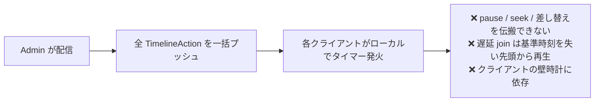
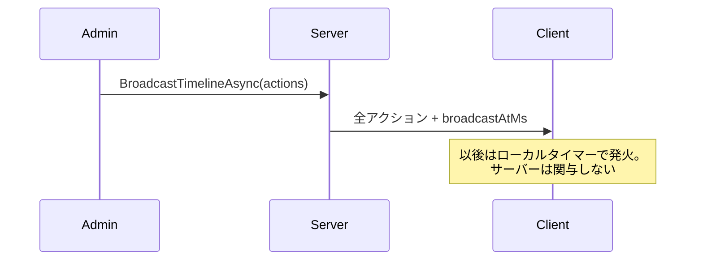
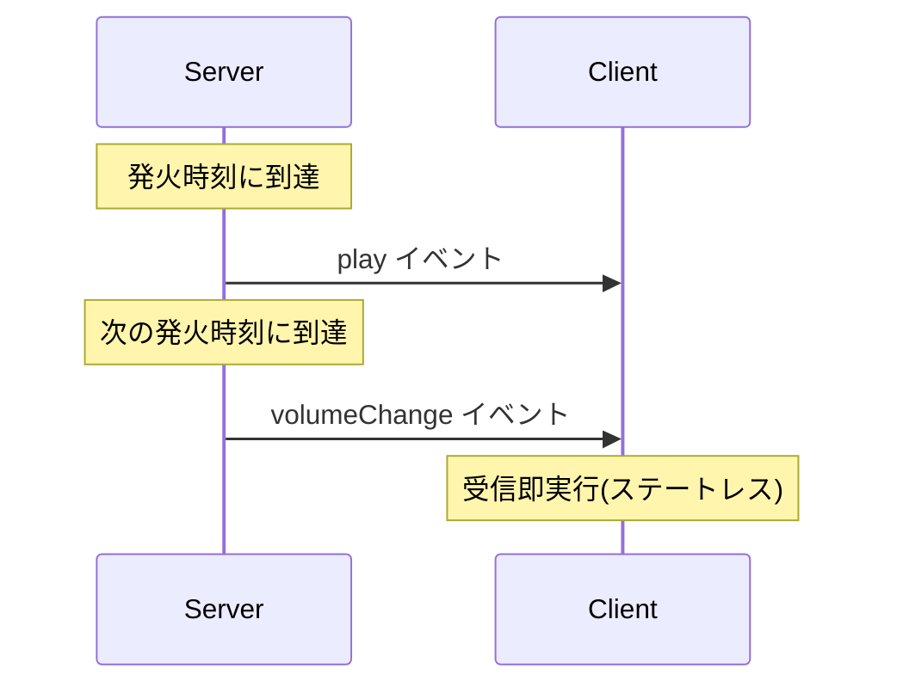
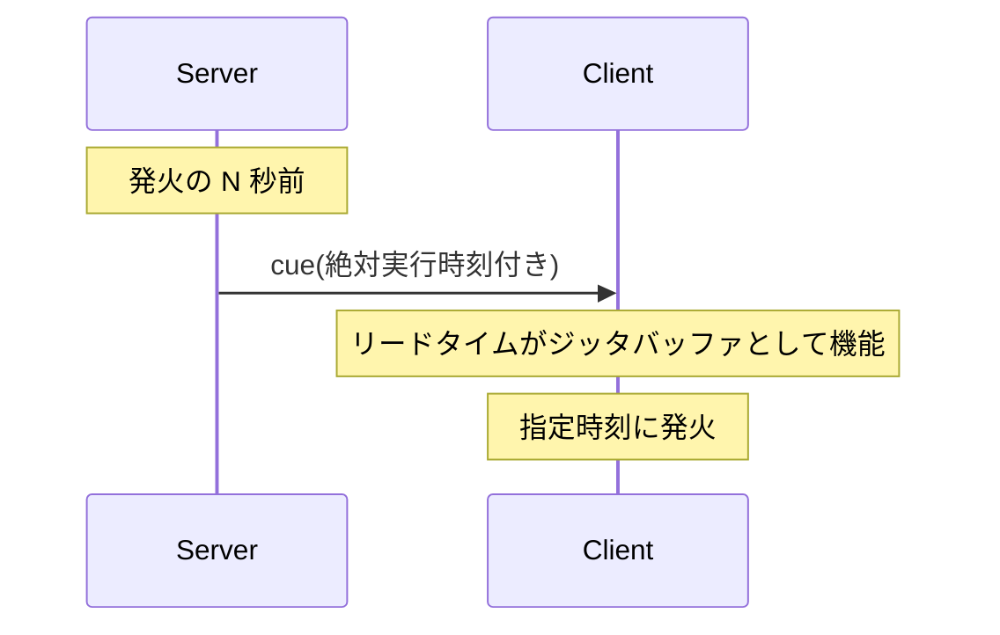
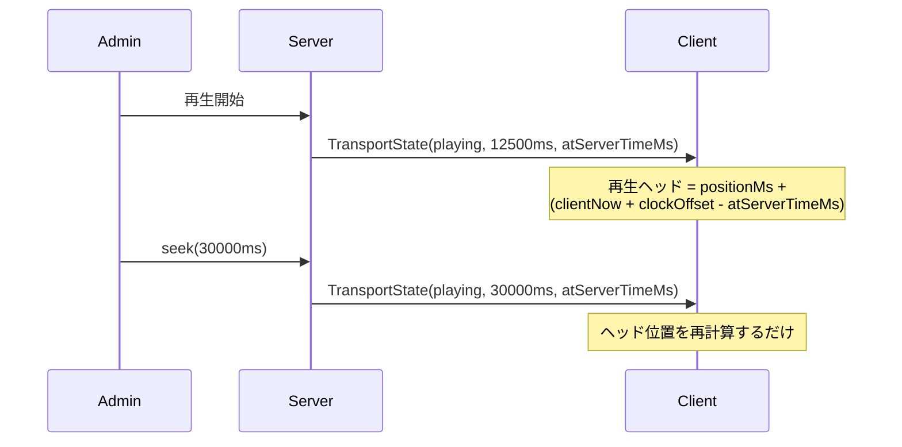
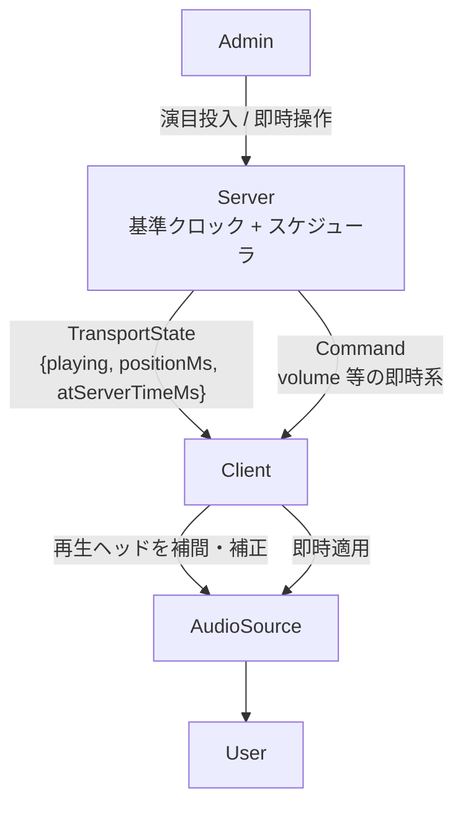
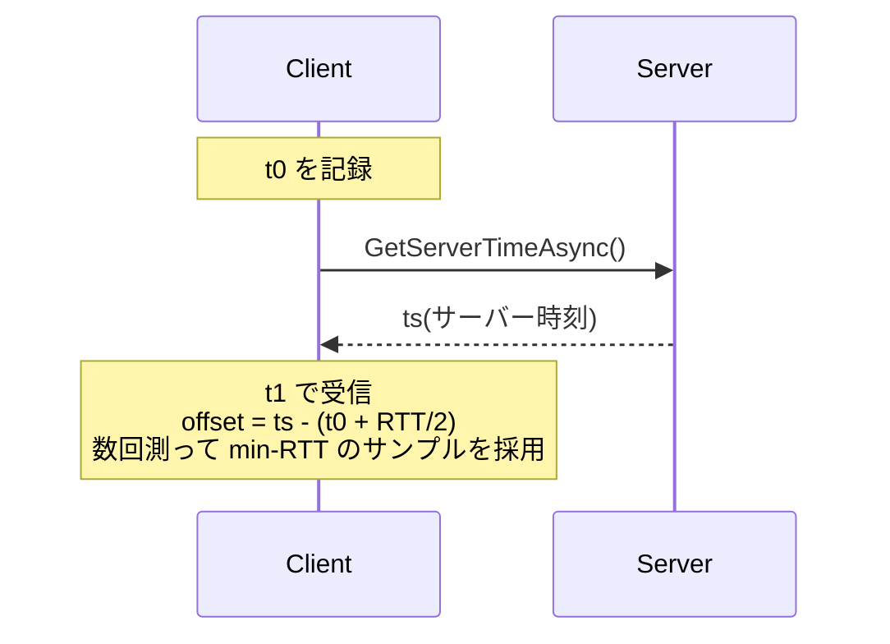

# タイムライン配信設計の検討

ステータス: **検討中**(未決定・未着手)
対象: [現状の配信設計](./timeline-broadcast.md)

## 課題

1. クライアント側の時刻計算の負荷
2. 絶対時刻(タイムコード)ベースでの配信操作が難しい
3. 再生の遅延・クライアント間のずれを最小化したい

## 前提の整理

**クライアント実装はまだ無い。** `Livisor.Client` には接続サンプルのみで、`OnBroadcastTimeline` の受信処理は未実装。設計変更のコストは現時点でほぼゼロ。

**課題1は設計要因ではない。** `broadcastAtMs + timecode` の加算コストは無視できる。負荷になるのは毎フレーム全走査のスケジューリング実装のみで、ソート済みキュー + 単発待機で回避できる。

本質的な問題は、現行方式が **fire-and-forget の一括プッシュ + クライアントサイドスケジューリング** である点。配信後にサーバーが制御プレーンを失う。

## 案の比較

### 案A: 現行維持(クライアントサイドスケジューリング)

- 利点: 配信後のネットワーク断に耐性がある
- 欠点: 配信後の介入経路が無い。制御プレーン喪失

### 案B: サーバーサイドスケジューリング(逐次イベントプッシュ)

- 利点: クライアントは最小実装。介入は常時可能
- 欠点: **イベントごとの伝送ジッタ(片道遅延の分散)が直接実行時刻ずれに変換される**。TCP/HTTP2 上で 10〜50ms のジッタは常態であり、音楽同期の要件を満たさない。課題3に逆行

### 案C: look-ahead cueing(先行キュー配信)

- 利点: ジッタをリードタイムで吸収。リードタイムより先は差し替え可能。放送系の定石
- 欠点: クロック同期が前提

### 案D: トランスポート同期(再生状態の配信)

離散イベントではなく再生状態 `{ playing, positionMs, atServerTimeMs }` を配信する。

キモは **状態メッセージの冪等性**。イベント(「再生しろ」)は到着遅延がそのまま実行遅延になるが、状態(「T 時点で X ms を再生中」)は到着が遅れても受信側で経過分を補間すれば正しい位置に収束する。到着遅延が再生ずれに変換されない。再接続時も最新状態の再送1回で回復する(last-write-wins)。Spotify Connect / NDI と同型のモデル。

- 利点: pause / seek / 遅延 join がすべて「状態1件の送信」に還元される
- 欠点: クロック同期が前提。サーバーが再生状態を保持する分、実装が増える

### 比較表

| | A 一括プッシュ | B 逐次プッシュ | C look-ahead | D トランスポート同期 |
|---|---|---|---|---|
| クライアント間のずれ | 片道遅延の差 | **伝送ジッタ直撃** | リードタイムで吸収 | 補間で収束 |
| 配信中の介入 | 不可 | 即時 | リードタイム先から | 即時 |
| 遅延 join | 先頭から再生 | 取りこぼす | 現在位置から | 現在位置から |
| 切断からの復帰 | 影響なし | イベント欠落 | 部分的耐性 | 状態再送で回復 |
| クロック同期 | 不要 | 不要 | 必要 | 必要 |

## 推奨案: D + C のハイブリッド(精度要件で経路を分離)

`play` と `volumeChange` を単一のワイヤ契約に載せている点が設計を歪めている根本原因。要求される時刻精度が2桁違うため、経路を分ける。

| 操作 | 要求精度 | 経路 |
|---|---|---|
| トランスポート制御(play / pause / seek) | ms オーダー | **案D**: TransportState を配信 |
| パラメータ変更(volume 等) | 数十ms ずれても知覚されない | 即時コマンド(案B相当) |
| 事前編成の演目 | — | サーバーを基準クロックとするスケジューラが、タイムコード到達時に上記2種へ展開して送出(案C) |

### 採用理由

- **操作性(課題2)**: 再生位置が状態なので、seek は `positionMs` の書き換え1回で済む。タイムコードの書き直しが不要
- **遅延・ずれ(課題3)**: TransportState は冪等。到着遅延は補間で吸収され、再生ずれに変換されない。案A・Bにはこの性質がない
- **遅延 join**: `JoinAsync` で現在の TransportState を1件返すだけで正しい途中位置から始まる。専用ロジックが消える

### トレードオフ

- クロックオフセット推定が必須(接続時 + ドリフト対策の周期的再推定)
- `Room` 集約が再生状態を持ち、Domain が太る
- サーバー側にスケジューラ(タイムコード → メッセージ展開)が増える

## クロック同期の実装方針

NTP ライクなオフセット推定。

- 以後のスケジューリングは `DateTime.UtcNow` ではなく `Stopwatch`(モノトニッククロック)基準にする。壁時計は NTP 補正でジャンプするため再生中の時刻基準に使えない
- クロックドリフト対策として数分周期で再推定する

## 移行ステップ

1. `Room` に再生状態(`playing` / `positionMs` / `startedAtServerMs`)を追加する(不変オブジェクト + `AddOrUpdate` の楽観的並行制御は現行のまま使える)
2. `ITimelineHubReceiver` を `OnTransportChanged` と `OnCommand` に分割する
3. クロック同期用の Unary サービス(`GetServerTimeAsync`)を追加する
4. タイムコード到達時にメッセージへ展開して送出するスケジューラを `Application` に置く(`IHostedService` または room ごとのタイマー)
5. クライアントは `Stopwatch` 基準で再生ヘッドを補間・補正する

`TimelineAction` / `PlaybackTime` は演目記述フォーマットとして温存する。廃止するのは「クライアントが配列全体を自前でスケジュールする」責務のみ。
