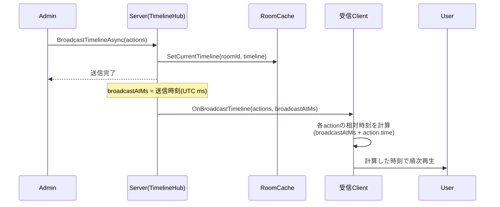
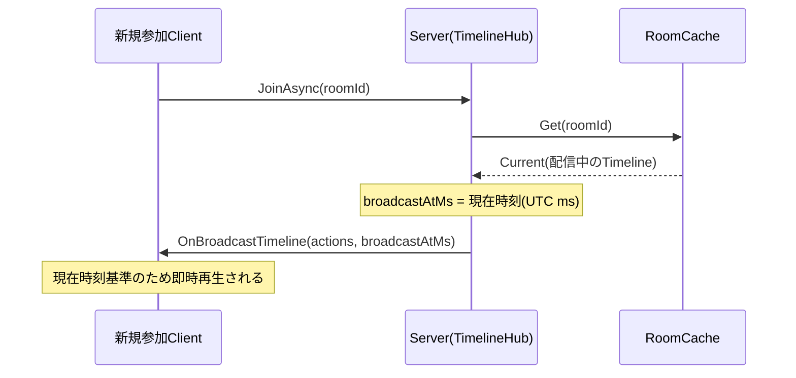
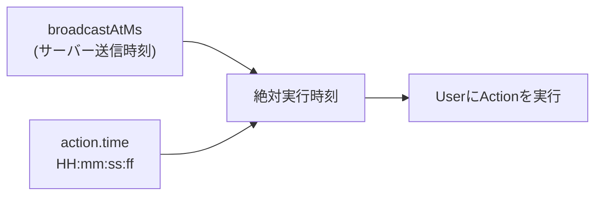

# タイムライン配信ロジック

## 概要
Admin(配信元)がタイムラインをサーバーへ送信する。サーバーは room 単位でタイムラインを保持し、同じ room の受信クライアントへ配信する。受信クライアントはサーバー送信時刻 `broadcastAtMs` を基準に各アクションの相対時刻を計算し、同時刻に再生する。

## 配信シーケンス

## 遅延参加シーケンス

room に後から参加したクライアントには、配信中のタイムラインを現在時刻基準で個別に再送する。

## データ構造

| フィールド | 型 | 説明 |
|---|---|---|
| `time` | string `"HH:mm:ss:ff"` | 実行時刻(時:分:秒:センチ秒) |
| `action` | ActionType | `play` / `volumeChange` |
| `value` | number / bool / string | `play=true/false`、`volumeChange=10` など |

- `Timeline` は1件以上の `TimelineAction` を時刻順(広義単調増加)で保持する。
- `Room` は room ごとに現在配信中の `Timeline` を1件だけ保持する(履歴は持たない、丸ごと差し替え)。

## 相対時刻計算

- 絶対実行時刻 = `broadcastAtMs + action.time`(先頭アクション基準の経過時間として扱う)。
- 同一 room 内の全受信クライアントが同じ `broadcastAtMs` を基準にするため、同時発火が保証される。

## 実装状況
- サーバー側(`TimelineHub` / `RoomCache` / `Timeline` 等)は実装済み。
- クライアント側の `OnBroadcastTimeline` 受信処理・相対時刻計算・再生処理は未実装(2026-08-25時点)。

## 現状の制約
- **配信後に介入できない。** 1回の `BroadcastTimelineAsync` でタイムライン全体を送るため、配信後に停止・シーク・差し替えができない。
- **途中参加は先頭から再生する。** `Room` は元の `broadcastAtMs` を保持しないため、`JoinAsync` は現在時刻を基準に再送する。参加者は経過分をスキップせず演目の先頭から再生する。
- **クライアントの壁時計に依存する。** `broadcastAtMs` はサーバー時刻だが、クロック同期の仕組みを持たない。

これらの見直しは [タイムライン配信設計の検討](./timeline-broadcast-redesign.md) にまとめる。
